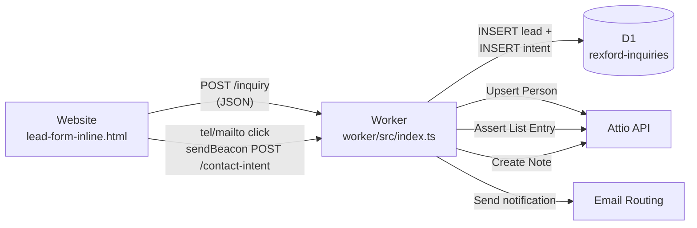

# Attio Website Lead Capture — Implementation Document (March 2026)

## 1) Objective

Integrate the existing Cloudflare Worker (`rexford-inquiry-worker`) with the **Attio CRM** so that:

1. Every **lead form submission** that is successfully saved to D1 also creates or updates a **Person** in Attio (idempotent by email), adds them to an **Inbound Leads** list, and attaches a **Note** with the full submission context.
2. **"Call us" (`tel:`) and "Email us" (`mailto:`)** link clicks already tracked in GA4 are _also_ persisted server-side via a new lightweight Worker endpoint, so they can be attached to the Attio lead record when the visitor later submits the form.
3. **Google Analytics context** (client/session IDs, UTMs, landing page, referrer) is captured in hidden form fields and stored with the lead in both D1 and Attio.

Attio API access uses a **single-workspace API key** (Bearer token) called only from the Worker. ([docs.attio.com — Authentication][1])

---

## 2) High-level architecture

### Current stack

| Layer | Technology |
|---|---|
| Static site | Hugo → Cloudflare Pages |
| Lead form | `layouts/partials/lead-form-inline.html` (HTML) + `assets/js/main.js` (vanilla JS fetch POST) |
| Backend | Cloudflare Worker (`worker/src/index.ts`) — single `/inquiry` endpoint today |
| Database | Cloudflare D1 (`rexford-inquiries`) — `inquiries` table |
| Email notification | Cloudflare Email Routing (`send_email` binding) |
| Bot protection | Cloudflare Turnstile |
| Analytics | GA4 (`G-WBKYLG69YV`) loaded via deferred `gtag.js` in `layouts/partials/head.html` |
| JS | Plain vanilla JS — no framework, no npm frontend pipeline |

### Data flow



### Why server-side only

* The Attio API key stays private inside the Worker.
* Deduplication, retries, and audit logging happen in one place.
* Contact-intent events can be correlated with later form submissions by `ga_client_id`.

---

## 3) Attio configuration (one-time manual setup)

### 3.1 Create an Attio API key

In the Attio workspace developer settings, generate a single-workspace API key. Store it as a **Wrangler secret**:

```bash
npx wrangler secret put ATTIO_API_KEY --config worker/wrangler.toml
```

Use it in requests as:

```
Authorization: Bearer <ATTIO_API_KEY>
```

**Required scopes:**

| Purpose | Scope(s) |
|---|---|
| Upsert Person | `record_permission:read-write`, `object_configuration:read` |
| Assert List Entry | `list_entry:read-write`, `list_configuration:read` |
| Create Note | `note:read-write`, `object_configuration:read`, `record_permission:read` |

### 3.2 Create an "Inbound Leads" list

In the Attio UI, create a **List** based on the **People** object named **Inbound Leads**.

**Statuses (configure in Attio UI):**

| Status | Notes |
|---|---|
| New | Must be the **first / default** status so the API doesn't need to set it |
| Contacted | |
| Qualified | |
| Disqualified | |

After creation, note the **list UUID** — it will be stored as a Worker var (see §6.1).

### 3.3 Optional: custom Person attributes

If you want UTM / GA fields directly on the Person record (searchable in Attio), create these text attributes on the People object via the Attio UI or the `POST /v2/objects/people/attributes` endpoint ([docs.attio.com — Create Attribute][6]):

* `utm_source`, `utm_medium`, `utm_campaign`, `utm_term`, `utm_content`
* `gclid`
* `ga_client_id`
* `landing_page`
* `referrer`

> **✅ Done:** These attributes have been created via `scripts/attio-create-attributes.sh`. The Worker should populate them on the Person record during upsert in addition to including them in the Note body.

---

## 4) Data model decisions

### 4.1 Person-first (no Company)

Your leads are small business owners. You rarely know the business entity name at submission time.

**Decision:**

* Always create/update a **Person** record.
* Do **not** create or link a **Company** record in Phase 1.
* If needed later, Attio can infer companies from non-free email domains automatically.

### 4.2 Dedupe rule

**Email is the unique key.**

Use Attio's "Assert a person Record" endpoint:

* `PUT /v2/objects/people/records?matching_attribute=email_addresses`

If a Person with that email exists, it updates in place. Otherwise, a new Person is created. ([docs.attio.com — Assert Person][2])

---

## 5) Frontend changes

### 5.1 Add hidden fields to the lead form

Add these hidden inputs to `layouts/partials/lead-form-inline.html` (inside the `<form>`):

```html
<input type="hidden" name="gaClientId" />
<input type="hidden" name="gaSessionId" />
<input type="hidden" name="gaSessionNumber" />
<input type="hidden" name="gclid" />
<input type="hidden" name="utmSource" />
<input type="hidden" name="utmMedium" />
<input type="hidden" name="utmCampaign" />
<input type="hidden" name="utmTerm" />
<input type="hidden" name="utmContent" />
<input type="hidden" name="landingPage" />
<input type="hidden" name="referrer" />
```

### 5.2 Populate hidden fields from GA4 + URL (in `assets/js/main.js`)

GA4 is loaded via a deferred `gtag.js` script in `head.html`. The GA4 Measurement ID is available in Hugo as `site.Params.ga4ID` (`G-WBKYLG69YV`). The `gtag('get', ...)` API can retrieve `client_id`, `session_id`, and `session_number` once the tag has initialised. ([Google — gtag.js Reference][8])

Add to `assets/js/main.js`:

```js
// --- GA/UTM context capture for lead forms ---
const populateHiddenFields = (form) => {
  const params = new URLSearchParams(window.location.search);

  // UTM parameters from the current URL
  const set = (name, value) => {
    const input = form.querySelector(`input[name="${name}"]`);
    if (input) input.value = value || "";
  };

  set("utmSource",   params.get("utm_source"));
  set("utmMedium",   params.get("utm_medium"));
  set("utmCampaign", params.get("utm_campaign"));
  set("utmTerm",     params.get("utm_term"));
  set("utmContent",  params.get("utm_content"));
  set("gclid",       params.get("gclid"));
  set("landingPage",  window.location.href);
  set("referrer",    document.referrer);

  // GA4 identifiers (async — gtag may not be loaded yet)
  if (typeof gtag === "function") {
    const ga4Id = "G-WBKYLG69YV";
    gtag("get", ga4Id, "client_id",      (v) => set("gaClientId", v));
    gtag("get", ga4Id, "session_id",     (v) => set("gaSessionId", v));
    gtag("get", ga4Id, "session_number", (v) => set("gaSessionNumber", v));
  }
};

inquiryForms.forEach((form) => {
  if (form instanceof HTMLFormElement) populateHiddenFields(form);
});
```

> **Note:** The `gtag('get', ...)` callbacks fire asynchronously. Because the form won't be submitted instantly, the hidden fields will be populated by the time the user finishes filling out visible fields.

### 5.3 Include hidden fields in the JSON payload

Update the `getInquiryPayload` function in `assets/js/main.js` to include the new fields:

```js
// Add to the returned object in getInquiryPayload:
gaClientId:    toTrimmedString(formData.get("gaClientId")),
gaSessionId:   toTrimmedString(formData.get("gaSessionId")),
gaSessionNumber: toTrimmedString(formData.get("gaSessionNumber")),
gclid:         toTrimmedString(formData.get("gclid")),
utmSource:     toTrimmedString(formData.get("utmSource")),
utmMedium:     toTrimmedString(formData.get("utmMedium")),
utmCampaign:   toTrimmedString(formData.get("utmCampaign")),
utmTerm:       toTrimmedString(formData.get("utmTerm")),
utmContent:    toTrimmedString(formData.get("utmContent")),
landingPage:   toTrimmedString(formData.get("landingPage")),
referrer:      toTrimmedString(formData.get("referrer")),
```

### 5.4 Fire `generate_lead` GA4 event

Replace the existing `form_submit` `trackEvent` call in the success branch with the GA4 recommended event:

```js
trackEvent("generate_lead", {
  form_source: payload.source,
  loan_type: payload.loanType,
  loan_amount: payload.loanAmount,
});
```

`generate_lead` is a GA4 recommended event for lead forms. ([Google — GA4 Events Reference][9])

### 5.5 Add `sendBeacon` to tel/mailto click handlers

The existing phone/email click handlers in `main.js` (lines 322–363) already fire GA events. Add a `sendBeacon` call to persist the intent server-side:

```js
// Add to the phone_click handler (after the trackEvent call):
const intentPayload = {
  type: "tel_click",
  gaClientId: "",    // populated below
  gaSessionId: "",
  gaSessionNumber: "",
  landingPage: window.location.href,
  referrer: document.referrer,
  timestamp: new Date().toISOString(),
};

// Attempt to get GA IDs (best-effort, async)
if (typeof gtag === "function") {
  const ga4Id = "G-WBKYLG69YV";
  gtag("get", ga4Id, "client_id",      (v) => { intentPayload.gaClientId = v; });
  gtag("get", ga4Id, "session_id",     (v) => { intentPayload.gaSessionId = v; });
  gtag("get", ga4Id, "session_number", (v) => { intentPayload.gaSessionNumber = v; });
}

// Fire after a small delay to let gtag callbacks run
setTimeout(() => {
  const endpoint = "https://rexford-inquiry-worker.joe5saia.workers.dev/contact-intent";
  navigator.sendBeacon(endpoint, JSON.stringify(intentPayload));
}, 100);
```

Apply the same pattern for `mailto_click` with `type: "mailto_click"`.

> `sendBeacon` is used because the browser navigates away to the dialer / email client immediately after the click, and `sendBeacon` survives that navigation.

### 5.6 UTM persistence across pages

UTM parameters are only in the URL on the landing page. If the user navigates to `/get-started/` before submitting, the UTMs are lost.

**Solution:** On page load, if `utm_source` is present in the query string, save all UTM params + `gclid` to `sessionStorage`. When populating hidden fields, fall back to `sessionStorage` if the current URL has no UTMs.

---

## 6) Backend changes (Worker)

All changes are in `worker/src/index.ts`.

### 6.1 New environment bindings

Add to `wrangler.toml`:

```toml
[vars]
# ... existing vars ...
ATTIO_LIST_ID = "4ad14cf6-ce4c-4026-bb95-0fdb8c1a7134"
```

Add as Wrangler secrets (never in `wrangler.toml`):

```bash
npx wrangler secret put ATTIO_API_KEY --config worker/wrangler.toml
```

Update the `Env` interface in `index.ts`:

```typescript
interface Env {
  // ... existing bindings ...
  ATTIO_API_KEY?: string;
  ATTIO_LIST_ID?: string;
}
```

### 6.2 Expand `InquiryPayload` and related types

```typescript
interface InquiryPayload {
  // ... existing fields ...
  gaClientId: string;
  gaSessionId: string;
  gaSessionNumber: string;
  gclid: string;
  utmSource: string;
  utmMedium: string;
  utmCampaign: string;
  utmTerm: string;
  utmContent: string;
  landingPage: string;
  referrer: string;
}
```

Add corresponding entries to `MAX_LENGTHS` and update `mapInquiryPayload` to extract the new fields (with `pickField` aliases).

### 6.3 D1 schema migration: `0003_add_analytics_and_attio_columns.sql`

```sql
-- Add analytics context columns to inquiries
ALTER TABLE inquiries ADD COLUMN ga_client_id TEXT;
ALTER TABLE inquiries ADD COLUMN ga_session_id TEXT;
ALTER TABLE inquiries ADD COLUMN ga_session_number TEXT;
ALTER TABLE inquiries ADD COLUMN gclid TEXT;
ALTER TABLE inquiries ADD COLUMN utm_source TEXT;
ALTER TABLE inquiries ADD COLUMN utm_medium TEXT;
ALTER TABLE inquiries ADD COLUMN utm_campaign TEXT;
ALTER TABLE inquiries ADD COLUMN utm_term TEXT;
ALTER TABLE inquiries ADD COLUMN utm_content TEXT;
ALTER TABLE inquiries ADD COLUMN landing_page TEXT;
ALTER TABLE inquiries ADD COLUMN referrer TEXT;

-- Attio sync tracking
ALTER TABLE inquiries ADD COLUMN attio_person_id TEXT;
ALTER TABLE inquiries ADD COLUMN attio_list_entry_id TEXT;
ALTER TABLE inquiries ADD COLUMN attio_note_id TEXT;
ALTER TABLE inquiries ADD COLUMN attio_sync_status TEXT NOT NULL DEFAULT 'pending';
ALTER TABLE inquiries ADD COLUMN attio_sync_error TEXT;
ALTER TABLE inquiries ADD COLUMN attio_synced_at TEXT;

-- Index for contact-intent correlation
CREATE INDEX IF NOT EXISTS idx_inquiries_ga_client_id ON inquiries(ga_client_id);
```

### 6.4 D1 schema migration: `0004_create_contact_intents.sql`

```sql
CREATE TABLE IF NOT EXISTS contact_intents (
  id INTEGER PRIMARY KEY AUTOINCREMENT,
  created_at TEXT NOT NULL,
  type TEXT NOT NULL,          -- 'tel_click' or 'mailto_click'
  ga_client_id TEXT,
  ga_session_id TEXT,
  ga_session_number TEXT,
  landing_page TEXT,
  referrer TEXT,
  ip_hash TEXT
);

CREATE INDEX IF NOT EXISTS idx_contact_intents_ga_client_id
  ON contact_intents(ga_client_id, created_at DESC);
```

### 6.5 New endpoint: `POST /contact-intent`

Add routing in the `fetch` handler:

```typescript
if (requestUrl.pathname === "/contact-intent") {
  // Accept POST only; no Turnstile required (fire-and-forget from sendBeacon)
  if (request.method === "OPTIONS") {
    return cors.allowed
      ? new Response(null, { status: 204, headers: cors.headers })
      : jsonResponse({ ok: false, error: "Origin not allowed" }, 403, cors.headers);
  }
  if (request.method !== "POST") {
    return jsonResponse({ ok: false, error: "Method not allowed" }, 405, cors.headers);
  }
  if (!cors.allowed) {
    return jsonResponse({ ok: false, error: "Origin not allowed" }, 403, cors.headers);
  }

  let body: Record<string, string>;
  try {
    body = await request.json();
  } catch {
    return new Response(null, { status: 400, headers: cors.headers });
  }

  const clientIp = normalizeText(request.headers.get("cf-connecting-ip")) || null;
  const ipHash = await hashIp(clientIp);

  await env.INQUIRY_DB.prepare(
    `INSERT INTO contact_intents
       (created_at, type, ga_client_id, ga_session_id, ga_session_number,
        landing_page, referrer, ip_hash)
     VALUES (?, ?, ?, ?, ?, ?, ?, ?)`
  ).bind(
    new Date().toISOString(),
    normalizeText(body.type),
    normalizeText(body.gaClientId),
    normalizeText(body.gaSessionId),
    normalizeText(body.gaSessionNumber),
    normalizeText(body.landingPage),
    normalizeText(body.referrer),
    ipHash,
  ).run();

  return new Response(null, { status: 204, headers: cors.headers });
}
```

`sendBeacon` sends with `Content-Type: text/plain;charset=UTF-8` by default. To send JSON with the correct content type, use `new Blob([JSON.stringify(payload)], { type: "application/json" })` on the frontend, or handle both content types in the Worker.

### 6.6 Attio API client functions

Add a thin client layer inside `index.ts` (no external dependencies):

```typescript
const ATTIO_BASE_URL = "https://api.attio.com";

/** Shared fetch wrapper for Attio API calls with Bearer auth. */
async function attioFetch(
  env: Env,
  method: string,
  path: string,
  body?: unknown
): Promise<{ ok: boolean; status: number; data?: unknown; error?: string }> {
  if (!env.ATTIO_API_KEY) {
    return { ok: false, status: 0, error: "ATTIO_API_KEY not configured" };
  }

  const response = await fetch(`${ATTIO_BASE_URL}${path}`, {
    method,
    headers: {
      Authorization: `Bearer ${env.ATTIO_API_KEY}`,
      "Content-Type": "application/json",
    },
    body: body ? JSON.stringify(body) : undefined,
  });

  if (!response.ok) {
    const text = await response.text();
    return { ok: false, status: response.status, error: text.slice(0, 500) };
  }

  const data = await response.json();
  return { ok: true, status: response.status, data };
}
```

#### 6.6.1 Upsert Person

```typescript
/** Creates or updates a Person in Attio, matching by email address. */
async function upsertAttioPerson(
  env: Env,
  payload: InquiryPayload
): Promise<{ personRecordId: string | null; error?: string }> {
  const result = await attioFetch(env, "PUT",
    "/v2/objects/people/records?matching_attribute=email_addresses",
    {
      data: {
        values: {
          email_addresses: [{ email_address: payload.email }],
          name: [{
            first_name: payload.firstName,
            last_name: payload.lastName,
            full_name: `${payload.firstName} ${payload.lastName}`,
          }],
          phone_numbers: payload.phone
            ? [{ original_phone_number: payload.phone }]
            : [],
          // Custom attributes (created via scripts/attio-create-attributes.sh)
          utm_source: payload.utmSource ? [{ value: payload.utmSource }] : [],
          utm_medium: payload.utmMedium ? [{ value: payload.utmMedium }] : [],
          utm_campaign: payload.utmCampaign ? [{ value: payload.utmCampaign }] : [],
          utm_term: payload.utmTerm ? [{ value: payload.utmTerm }] : [],
          utm_content: payload.utmContent ? [{ value: payload.utmContent }] : [],
          gclid: payload.gclid ? [{ value: payload.gclid }] : [],
          ga_client_id: payload.gaClientId ? [{ value: payload.gaClientId }] : [],
          landing_page: payload.landingPage ? [{ value: payload.landingPage }] : [],
          referrer: payload.referrer ? [{ value: payload.referrer }] : [],
        },
      },
    }
  );

  if (!result.ok) {
    return { personRecordId: null, error: result.error };
  }

  const record = result.data as { data?: { id?: { record_id?: string } } };
  return { personRecordId: record?.data?.id?.record_id ?? null };
}
```

([docs.attio.com — Assert Person][2])

#### 6.6.2 Assert List Entry

```typescript
/** Adds the Person to the "Inbound Leads" list (idempotent). */
async function assertAttioListEntry(
  env: Env,
  personRecordId: string
): Promise<{ entryId: string | null; error?: string }> {
  if (!env.ATTIO_LIST_ID) {
    return { entryId: null, error: "ATTIO_LIST_ID not configured" };
  }

  const result = await attioFetch(env, "PUT",
    `/v2/lists/${env.ATTIO_LIST_ID}/entries`,
    {
      data: {
        parent_record_id: personRecordId,
        parent_object: "people",
        entry_values: {},
      },
    }
  );

  if (!result.ok) {
    return { entryId: null, error: result.error };
  }

  const entry = result.data as { data?: { id?: { entry_id?: string } } };
  return { entryId: entry?.data?.id?.entry_id ?? null };
}
```

([docs.attio.com — Assert List Entry][3])

#### 6.6.3 Create Note

```typescript
/** Attaches a markdown Note to the Person with full submission context. */
async function createAttioNote(
  env: Env,
  personRecordId: string,
  payload: InquiryPayload,
  inquiryId: number,
  submittedAt: string,
  contactIntents: Array<{ type: string; created_at: string; landing_page: string }>
): Promise<{ noteId: string | null; error?: string }> {
  const lines: string[] = [
    `# Website Inquiry #${inquiryId}`,
    "",
    "## Contact Information",
    `- **Name:** ${payload.firstName} ${payload.lastName}`,
    `- **Email:** ${payload.email}`,
    `- **Phone:** ${payload.phone || "N/A"}`,
    "",
    "## Loan Details",
    `- **Type:** ${payload.loanType}`,
    `- **Amount:** ${payload.loanAmount}`,
    `- **Business Type:** ${payload.businessType || "N/A"}`,
    `- **Timeline:** ${payload.timeline || "N/A"}`,
    `- **Best Time to Call:** ${payload.bestTimeToCall || "N/A"}`,
    "",
    "## Additional Details",
    payload.details || "N/A",
    "",
    "## Marketing Context",
    `- **Source Page:** ${payload.source}`,
    `- **Landing Page:** ${payload.landingPage || "N/A"}`,
    `- **Referrer:** ${payload.referrer || "N/A"}`,
    `- **UTM Source:** ${payload.utmSource || "N/A"}`,
    `- **UTM Medium:** ${payload.utmMedium || "N/A"}`,
    `- **UTM Campaign:** ${payload.utmCampaign || "N/A"}`,
    `- **UTM Term:** ${payload.utmTerm || "N/A"}`,
    `- **UTM Content:** ${payload.utmContent || "N/A"}`,
    `- **GCLID:** ${payload.gclid || "N/A"}`,
    "",
    "## Analytics",
    `- **GA Client ID:** ${payload.gaClientId || "N/A"}`,
    `- **GA Session ID:** ${payload.gaSessionId || "N/A"}`,
    `- **GA Session #:** ${payload.gaSessionNumber || "N/A"}`,
    `- **Submitted At:** ${submittedAt}`,
  ];

  if (contactIntents.length > 0) {
    lines.push("", "## Prior Contact Intents");
    for (const intent of contactIntents) {
      lines.push(`- **${intent.type}** at ${intent.created_at} (page: ${intent.landing_page || "N/A"})`);
    }
  }

  const result = await attioFetch(env, "POST", "/v2/notes", {
    data: {
      parent_object: "people",
      parent_record_id: personRecordId,
      title: `Website Inquiry #${inquiryId}: ${payload.firstName} ${payload.lastName}`,
      format: "markdown",
      content: lines.join("\n"),
    },
  });

  if (!result.ok) {
    return { noteId: null, error: result.error };
  }

  const note = result.data as { data?: { id?: { note_id?: string } } };
  return { noteId: note?.data?.id?.note_id ?? null };
}
```

([docs.attio.com — Create Note][4])

### 6.7 Orchestrate Attio sync after DB insert

After the existing `INSERT INTO inquiries` succeeds (line ~190 in current code), call:

```typescript
// Attio CRM sync (best-effort, non-blocking of email notification)
const attioResult = await syncToAttio(env, payload, inquiryId, submittedAt);
if (attioResult.error) {
  console.error("Attio sync failed:", attioResult.error);
}
```

Where `syncToAttio` is:

```typescript
interface AttioSyncResult {
  personRecordId: string | null;
  listEntryId: string | null;
  noteId: string | null;
  error: string | null;
}

async function syncToAttio(
  env: Env,
  payload: InquiryPayload,
  inquiryId: number,
  submittedAt: string
): Promise<AttioSyncResult> {
  const result: AttioSyncResult = {
    personRecordId: null, listEntryId: null, noteId: null, error: null,
  };

  // Step 1: Upsert Person
  const person = await upsertAttioPerson(env, payload);
  if (!person.personRecordId) {
    result.error = `Person upsert failed: ${person.error}`;
    await updateAttioSyncStatus(env, inquiryId, "failed", result);
    return result;
  }
  result.personRecordId = person.personRecordId;

  // Step 2: Assert List Entry
  const entry = await assertAttioListEntry(env, result.personRecordId);
  if (!entry.entryId) {
    result.error = `List entry failed: ${entry.error}`;
    await updateAttioSyncStatus(env, inquiryId, "failed", result);
    return result;
  }
  result.listEntryId = entry.entryId;

  // Step 3: Fetch prior contact intents for this GA client ID
  let contactIntents: Array<{ type: string; created_at: string; landing_page: string }> = [];
  if (payload.gaClientId) {
    const rows = await env.INQUIRY_DB.prepare(
      `SELECT type, created_at, landing_page FROM contact_intents
       WHERE ga_client_id = ? AND created_at >= datetime('now', '-30 days')
       ORDER BY created_at DESC LIMIT 20`
    ).bind(payload.gaClientId).all();
    contactIntents = (rows.results ?? []) as typeof contactIntents;
  }

  // Step 4: Create Note
  const note = await createAttioNote(
    env, result.personRecordId, payload, inquiryId, submittedAt, contactIntents
  );
  if (!note.noteId) {
    result.error = `Note creation failed: ${note.error}`;
    await updateAttioSyncStatus(env, inquiryId, "partial", result);
    return result;
  }
  result.noteId = note.noteId;

  await updateAttioSyncStatus(env, inquiryId, "success", result);
  return result;
}

/** Persists Attio sync outcomes to D1 for auditability. */
async function updateAttioSyncStatus(
  env: Env,
  inquiryId: number,
  status: string,
  result: AttioSyncResult
): Promise<void> {
  await env.INQUIRY_DB.prepare(
    `UPDATE inquiries SET
       attio_person_id = ?,
       attio_list_entry_id = ?,
       attio_note_id = ?,
       attio_sync_status = ?,
       attio_sync_error = ?,
       attio_synced_at = ?
     WHERE id = ?`
  ).bind(
    result.personRecordId,
    result.listEntryId,
    result.noteId,
    status,
    result.error?.slice(0, 500) ?? null,
    new Date().toISOString(),
    inquiryId,
  ).run();
}
```

### 6.8 Error handling: Attio failure MUST NOT break form submission

**Critical rule:** The existing behavior — save to D1, send email, return success — must remain the primary path. Attio sync is **secondary**. If Attio is down:

* The submission is still saved to D1 (with `attio_sync_status = 'failed'`).
* The email notification is still sent.
* The user still sees the thank-you page.
* Failed syncs are visible in D1 for manual replay or a future retry job.

### 6.9 Rate limiting for `/contact-intent`

The endpoint is lightweight and fire-and-forget, but still needs abuse protection:

* Reuse the existing `hashIp` function.
* Limit to **20 intent events per IP per 10-minute window** (generous, since real users won't click tel/mailto that often).
* Silent drop (return 204 anyway) to avoid leaking rate-limit info to bots.

---

## 7) Handling tel/mailto clicks that never submit a form

### Phase 1 (this implementation)

* Track clicks in GA4 (already done today) + store `contact_intents` in D1 (new).
* If a form later arrives from the same `ga_client_id`, the Attio note includes a section listing prior contact intents.
* Intent rows without a matching form submission are available for periodic review in D1.

### Phase 2 (future, not in scope)

* **Inbound email automation:** Route email to a shared `sales@rexfordcc.com` inbox; build an ingestion job that upserts the sender as a Person in Attio.
* **Call tracking:** Use a provider that can webhook call events with caller ID to create Attio records for actual completed calls.

---

## 8) Idempotency and retry considerations

| Resource | Idempotency mechanism |
|---|---|
| Person | `PUT` upsert with `matching_attribute=email_addresses` — safe to retry. |
| List Entry | `PUT` assert by `parent_record_id` — safe to retry (errors if >1 entry for same parent; unlikely with upsert). |
| Note | `POST` — creates a new note each time. Mitigate duplicates by: (a) including `inquiryId` in the title for human identification, (b) only calling once per inquiry, (c) storing `attio_note_id` in D1 and skipping if already set on retry. |

### Rate limits

Attio applies rate limits per workspace. The current API does not publish exact numbers, but the Worker already processes leads one at a time with no batch operations, so this should be well within limits.

If a `429` is returned, log it and leave `attio_sync_status = 'rate_limited'` in D1. A future cron-triggered Worker could retry these.

---

## 9) Acceptance criteria

### Lead form → Attio

- [ ] Submitting the form creates/updates a Person in Attio with email + name + phone.
- [ ] The person appears in the "Inbound Leads" list (exactly one entry per person).
- [ ] A markdown Note is attached to the person containing: form fields, UTMs, landing page, referrer, GA IDs.
- [ ] Submitting the same email twice updates the Person (no duplicate) and creates a second Note (one per submission).

### Tel/mailto intent tracking

- [ ] Clicking a `tel:` or `mailto:` link fires a GA4 event (already done) **and** sends a `sendBeacon` to `/contact-intent`.
- [ ] The `contact_intents` table in D1 records the event with `ga_client_id`, type, and timestamp.
- [ ] If the same user later submits the form (same `ga_client_id`), the Attio Note includes a "Prior Contact Intents" section.

### Reliability

- [ ] If Attio is unreachable or returns an error, the form submission still succeeds (D1 save + email).
- [ ] `attio_sync_status` in the `inquiries` table reflects `success`, `partial`, `failed`, or `rate_limited`.
- [ ] `ATTIO_API_KEY` is stored as a Wrangler secret, never in source or `wrangler.toml`.

### No regressions

- [ ] `make ci` passes (Hugo build).
- [ ] Existing form submission flow (Turnstile → D1 → email → redirect) is unchanged.
- [ ] No PII (email, phone, name) is sent to GA4.

---

## 10) Implementation checklist

### One-time Attio setup

1. [ ] Create Attio API key with required scopes → `npx wrangler secret put ATTIO_API_KEY`.
2. [ ] Create "Inbound Leads" list in Attio UI → copy list UUID → add to `wrangler.toml` as `ATTIO_LIST_ID`.
3. [ ] Configure list statuses: New (default), Contacted, Qualified, Disqualified.

### D1 migrations

4. [ ] Create `worker/migrations/0003_add_analytics_and_attio_columns.sql`.
5. [ ] Create `worker/migrations/0004_create_contact_intents.sql`.
6. [ ] Run `npm run d1:migrate:local` + `npm run d1:migrate:remote`.

### Frontend (`layouts/` + `assets/js/`)

7. [ ] Add hidden inputs to `layouts/partials/lead-form-inline.html`.
8. [ ] Add GA/UTM population logic to `assets/js/main.js`.
9. [ ] Add new fields to `getInquiryPayload` in `assets/js/main.js`.
10. [ ] Add `sendBeacon` calls to existing phone/email click handlers.
11. [ ] Add `sessionStorage` UTM persistence for cross-page navigation.
12. [ ] Replace `form_submit` event with `generate_lead`.

### Worker (`worker/src/index.ts`)

13. [ ] Update `Env` interface with `ATTIO_API_KEY`, `ATTIO_LIST_ID`.
14. [ ] Expand `InquiryPayload`, `MAX_LENGTHS`, `mapInquiryPayload` for new fields.
15. [ ] Update `INSERT INTO inquiries` to include analytics + Attio columns.
16. [ ] Add routing for `POST /contact-intent`.
17. [ ] Implement `attioFetch`, `upsertAttioPerson`, `assertAttioListEntry`, `createAttioNote`.
18. [ ] Implement `syncToAttio` orchestrator + `updateAttioSyncStatus`.
19. [ ] Wire `syncToAttio` into the `/inquiry` handler (after D1 insert, before email send).

### Deployment

20. [ ] Deploy migrations: `npm run d1:migrate:remote`.
21. [ ] Deploy Worker: `npm run deploy:worker`.
22. [ ] Deploy Hugo site (Cloudflare Pages auto-deploys on push).

### QA

23. [ ] Submit form → verify Person + List Entry + Note in Attio.
24. [ ] Submit same email again → verify Person is updated, second Note created, no duplicate list entry.
25. [ ] Click tel/mailto → submit form → verify Note includes "Prior Contact Intents" section.
26. [ ] Block Attio (e.g., bad API key) → submit form → verify D1 + email still succeed, `attio_sync_status = 'failed'`.
27. [ ] Verify no PII leaks to GA4 (`generate_lead` params are safe).
28. [ ] `make ci` passes.

---

## References

[1]: https://docs.attio.com/rest-api/guides/authentication "Attio — Authentication"
[2]: https://docs.attio.com/rest-api/endpoint-reference/people/assert-a-person-record "Attio — Assert Person"
[3]: https://docs.attio.com/rest-api/endpoint-reference/entries/assert-a-list-entry-by-parent "Attio — Assert List Entry"
[4]: https://docs.attio.com/rest-api/endpoint-reference/notes/create-a-note "Attio — Create Note"
[5]: https://docs.attio.com/rest-api/endpoint-reference/attributes/list-statuses "Attio — List Statuses"
[6]: https://docs.attio.com/rest-api/endpoint-reference/attributes/create-an-attribute "Attio — Create Attribute"
[7]: https://docs.attio.com/rest-api/endpoint-reference/people/create-a-person-record "Attio — Create Person"
[8]: https://developers.google.com/tag-platform/gtagjs/reference "Google — gtag.js Reference"
[9]: https://developers.google.com/analytics/devguides/collection/ga4/reference/events "Google — GA4 Events Reference"
